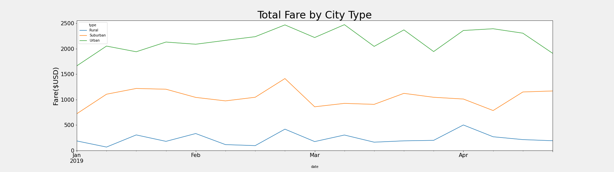

# PyBer Analysis

## Overview

The goal of this analysis is to clean the data set using pandas and to create a multiple line plot that shows the total weekly of the fares for each type of city using matplotlib

## Results
f

