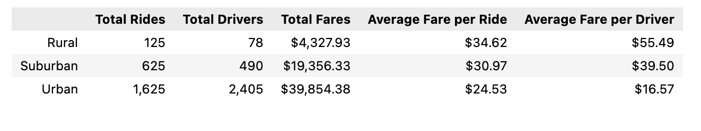
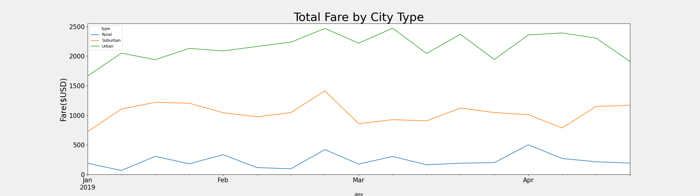

# PyBer Analysis

## Overview

The goal of this analysis is to clean the data set using pandas and to create a multiple line plot that shows the total weekly of the fares for each type of city using matplotlib

## Results

From the summary data frame, we can see that there may be a fashion among how populated a city is and the whole wide variety of rides, which immediately impacts the whole wide variety of drivers, overall fare, and each averages. Although the whole wide variety of rides, drivers, and fares lower because the city end up further from Urbanized areas, the common fare according to experience and according to driving force appears to boom. This may be defined through the accessibility of PyBer rides and drivers in Rural areas. Fewer drivers in rural regions will cause a better common fare according to experience and driving force, as fees boom whilst deliver is low.

